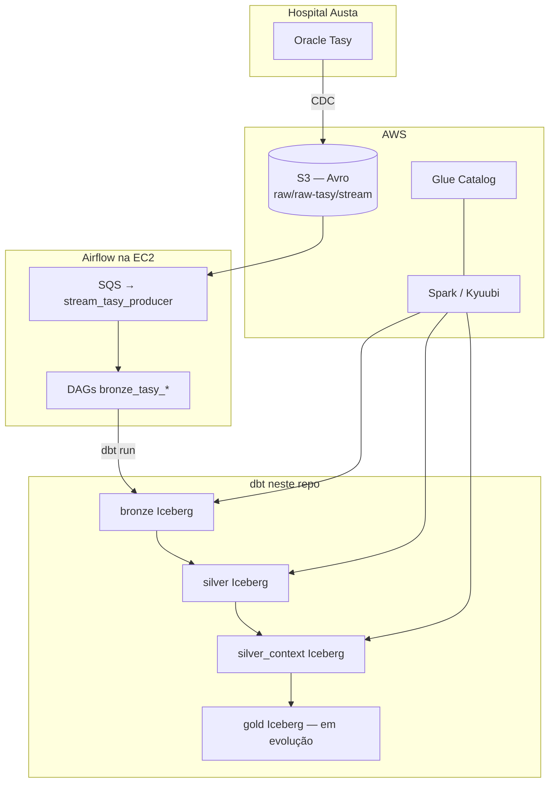

# dbt — Lakehouse Hospital Austa (Tasy)

Projeto [dbt](https://www.getdbt.com/) com **Apache Spark** (Thrift/**Kyuubi**), catálogo **AWS Glue** e tabelas **Iceberg**. Os dados operacionais do **Hospital Austa** chegam do **Oracle Tasy** via CDC, são gravados em **Avro no S3** e transformados em camadas **bronze → silver → silver_context → gold** neste repositório.

**Localização no monorepo:** pasta `dbt/` dentro de [datalake-austa](https://github.com/Dev-Infra-Grupo-AMH/datalake-austa).

---

## Arquitetura em uma página



- **Ingestão:** eventos CDC por tópico Tasy no prefixo `s3://…/raw/raw-tasy/stream/…`.
- **Orquestração:** DAG contínua `stream_tasy_producer` (SQS) produz **Airflow Datasets**; cada DAG `bronze_tasy_*` agenda com `schedule=[Dataset]` e executa `dbt run --select` no modelo bronze correspondente.
- **Transformação:** dbt compila SQL e o Spark executa leituras/escritas Iceberg registradas no Glue.

Leitura detalhada (Airflow + Cosmos + orquestradores): **[docs/ARCHITECTURE.md](docs/ARCHITECTURE.md)**.

---

## Índice da documentação

| Documento | Conteúdo |
|-----------|----------|
| **[docs/ARCHITECTURE.md](docs/ARCHITECTURE.md)** | Fluxo Tasy → S3 → Airflow → dbt; stack Spark/Glue/Iceberg; o que está ativo nas DAGs. |
| **[docs/DATA_CONTRACTS.md](docs/DATA_CONTRACTS.md)** | Objetivos e contratos por camada (bronze append, silver merge + dedup, context, gold). |
| **[docs/MACROS.md](docs/MACROS.md)** | Referência das macros (`audit`, `hooks`, `tempo`, `texto`, `numerico`, `documentos`). |
| **[docs/PLUGINS.md](docs/PLUGINS.md)** | Pacote `plugins/`, `sitecustomize`, patch dbt-spark e `.env`. |
| **[docs/FLUXO_USO_E_DICAS.md](docs/FLUXO_USO_E_DICAS.md)** | Primeiros passos, comandos úteis, Windows, links para troubleshooting. |
| **[docs/dbt_camadas.md](../docs/dbt_camadas.md)** | Convenções e pseudo-código para juniors; inventário dos modelos em `models/`. |
| **[../airflow/dags/README.md](../airflow/dags/README.md)** | Organização das DAGs (extraction, orchestration, streaming, delivery). |
| **[../CLAUDE.md](../CLAUDE.md)** | Regras do monorepo (nomenclatura, testes, restrições dbt/Airflow). |

---

## O que você precisa (setup local)

| Requisito | Detalhe |
|-----------|---------|
| Python | 3.10 ou superior (recomendado) |
| Rede | Acesso ao host **Spark Thrift** (Kyuubi), em geral via **VPN** ou rede corporativa |
| Credenciais | Usuário/senha **LDAP** do ambiente (mesmos usados no Thrift) |
| AWS | Leitura em **S3** e metadados no **Glue** costumam ser feitos pelo cluster Spark; o dbt não precisa de AWS CLI instalado só para compilar, mas o engine precisa enxergar o datalake |

---

## 1. Clonar o repositório

```bash
git clone https://github.com/Dev-Infra-Grupo-AMH/datalake-austa.git
cd datalake-austa/dbt
```

> Se você já estiver na pasta `dbt/` do clone, os próximos comandos são os mesmos.

---

## 2. Ambiente virtual Python (`.venv`)

Evita conflito com outros projetos e fixa as versões do `requirements-dbt.txt`.

**Linux / macOS:**

```bash
python3 -m venv .venv
source .venv/bin/activate
pip install --upgrade pip
pip install -r requirements-dbt.txt
```

O `requirements-dbt.txt` inclui o pacote editável `./plugins`, que instala o patch `sitecustomize` (Thrift/PyHive + Glue) no venv — não é preciso configurar `PYTHONPATH` manualmente.

**Windows (PowerShell):**

```powershell
python -m venv .venv
.\.venv\Scripts\Activate.ps1
pip install --upgrade pip
pip install -r requirements-dbt.txt
```

Se você criou o `.venv` na **raiz do repositório** (`datalake-austa/.venv`) e está na pasta `dbt/`, ative assim (não use `.\.venv` dentro de `dbt/` se o venv não existir aí):

```powershell
..\.venv\Scripts\Activate.ps1
```

Confirme qual `dbt` o shell usa: `(Get-Command dbt).Source` deve apontar para `...\datalake-austa\.venv\Scripts\dbt.exe`, e **não** para `...\Python310\Scripts\dbt.exe`. Se aparecer o Python global, o comando `dbt` está errado — corrija a ativação do venv ou rode com o Python do venv: **`python -m dbt.cli.main`** (substitui `dbt` no mesmo terminal onde o venv está ativo).

Para desativar o venv depois: `deactivate`.

---

## 3. Credenciais locais (não vão para o Git)

1. Copie os exemplos fornecidos pelo time (quando existirem no repositório):

   - `.env.example` → `.env`
   - `profiles.yml.example` → `profiles.yml`

2. Edite **`.env`** e preencha:

   - `SPARK_THRIFT_HOST` — hostname do Thrift/Kyuubi  
   - `SPARK_THRIFT_PORT` — em geral `10009` (se omitir, o profile usa o default)  
   - `SPARK_THRIFT_USER` / `SPARK_THRIFT_PASSWORD` — LDAP  

3. **`profiles.yml`** pode referenciar variáveis de ambiente (`env_var`). Ajuste só se o time tiver outro catálogo Spark.

Arquivos **`.env`** e **`profiles.yml`** estão no `.gitignore` — não commite.

---

## 4. Apontar o dbt para este diretório

O dbt precisa achar o `profiles.yml` **na mesma pasta** do `dbt_project.yml`.

**Automático (recomendado)** — após `pip install -r requirements-dbt.txt`, o pacote `sitecustomize` em `./plugins`:

- Se **`DBT_PROFILES_DIR` não estiver definido**, tenta deduzir a pasta do projeto subindo a partir do diretório atual até achar `dbt_project.yml` (na raiz do repo isso costuma ser `.../datalake-austa/dbt`).
- Carrega **`dbt/.env`** com `python-dotenv` (variáveis já definidas no ambiente não são sobrescritas).

Assim, em geral **não** é preciso exportar `DBT_PROFILES_DIR` nem fazer `source .env` em todo terminal — basta ter o arquivo **`dbt/.env`** e rodar `dbt` com o **cwd** dentro da árvore do repositório (por exemplo pasta `dbt/` ou raiz do clone). Em **Airflow/CI**, se `DBT_PROFILES_DIR` já vier definido, esse valor é respeitado.

**Manual** (shells sem o venv do projeto, ou se quiser forçar outro profile):

**Linux / macOS:**

```bash
cd /caminho/completo/datalake-austa/dbt
export DBT_PROFILES_DIR="$(pwd)"
set -a && source .env && set +a
```

**Windows (PowerShell)** — ajuste o caminho:

```powershell
cd C:\caminho\datalake-austa\dbt
$env:DBT_PROFILES_DIR = (Get-Location).Path
Get-Content .env | ForEach-Object {
  if ($_ -match '^\s*([^#][^=]*)=(.*)$') {
    Set-Item -Path "env:$($matches[1].Trim())" -Value $matches[2].Trim()
  }
}
```

---

## 5. Validar a conexão

```bash
dbt debug
```

No Windows, se houver dúvida sobre qual `dbt.exe` está no PATH, use o módulo CLI do mesmo `python` do venv:

```powershell
python -m dbt.cli.main debug
```

Assim o interpretador ativo (do venv) executa o dbt (evita cair no `dbt.exe` de outra instalação).

Se falhar, confira VPN, host/porta e credenciais no **`dbt/.env`**. Se ainda exportar `DBT_PROFILES_DIR` manualmente, deve apontar para a pasta onde estão `dbt_project.yml` e `profiles.yml`.

---

## 6. Comandos do dia a dia

| Objetivo | Comando |
|----------|---------|
| Compilar SQL sem executar | `dbt compile` |
| Rodar todos os modelos | `dbt run` |
| Só Bronze | `dbt run --select models/bronze` |
| Um modelo | `dbt run --select bronze_tasy_atend_paciente_unidade` |
| Testes | `dbt test` |
| Documentação (opcional) | `dbt docs generate` |

Mais comandos e seleção de nós: **[docs/FLUXO_USO_E_DICAS.md](docs/FLUXO_USO_E_DICAS.md)**.

CDC Bronze (watermark, full-refresh, reprocessamento): **[RUNBOOK_CDC_BRONZE.md](RUNBOOK_CDC_BRONZE.md)**.

---

## 7. E o Airflow / EC2?

O deploy para o servidor (pastas `/opt/airflow/dags` e `/opt/airflow/dbt`) é feito pelo **GitHub Actions** ao dar push na branch **`main`**. O que roda na EC2 é cópia do repositório; **desenvolvimento interativo** com `dbt run` / `dbt test` costuma ser mais prático **no seu ambiente local** seguindo este README. Detalhe das DAGs: **[docs/ARCHITECTURE.md](docs/ARCHITECTURE.md)**.

---

## 8. Problemas comuns

| Sintoma | O que verificar |
|---------|------------------|
| `ModuleNotFoundError: No module named 'dbt'` | O **venv ativo não tem o dbt instalado** (venv novo, outro clone do repo ou cópia em outra pasta — ex.: Desktop vs OneDrive). Com o venv ativo, na pasta `dbt/`: `python -m pip install -r requirements-dbt.txt`. Depois confira `python -c "import dbt"` e se `(Get-Command dbt).Source` aponta para `...\seu\clone\.venv\Scripts\dbt.exe`. |
| `ModuleNotFoundError: No module named 'dbt.adapters.factory'` | O shell está usando o **`dbt` do Python global** (instalação incompleta ou antiga), não o do venv. Rode `(Get-Command dbt).Source` no PowerShell; deve ser `...\datalake-austa\.venv\Scripts\dbt.exe`. Corrija com `..\.venv\Scripts\Activate.ps1` a partir de `dbt/`, ou use `python -m dbt.cli.main debug`. Reinstale dependências no venv: `pip install -r requirements-dbt.txt`. |
| `Parsing Error` + `Env var required but not provided: 'SPARK_THRIFT_HOST'` | Falta **`dbt/.env`** ou ele não tem `SPARK_THRIFT_*`. Rode o `dbt` a partir da pasta do projeto com o venv que tem `python-dotenv` e o pacote `./plugins` instalados (`pip install -r requirements-dbt.txt`). |
| `Could not find profile named 'lakehouse_tasy'` | `DBT_PROFILES_DIR` não aponta para a pasta onde está `profiles.yml` — ou rode o `dbt` dentro da árvore do repo para o auto-detect atuar. |
| `env_var` não definida | Com o bootstrap do `sitecustomize`, o **`dbt/.env`** é carregado automaticamente. Sem isso, use `set -a && source .env` (Linux/macOS) ou o bloco PowerShell da seção 4. |
| Timeout / connection refused | VPN, security group, host/porta do Thrift |
| Erro ao ler S3/Avro | Permissões no cluster Spark/Glue, não no laptop em si |

---

## Variáveis do projeto

Parâmetros de bucket, prefixos de raw e CDC estão em **`dbt_project.yml`** (`vars`). Para sobrescrever em um comando:

```bash
dbt run --select bronze_tasy_atendimento_paciente --vars '{"cdc_reprocess_hours": 24}'
```

---

## Documentação adicional

Ver tabela no início deste README (**Índice da documentação**). Repositório: [datalake-austa](https://github.com/Dev-Infra-Grupo-AMH/datalake-austa).
