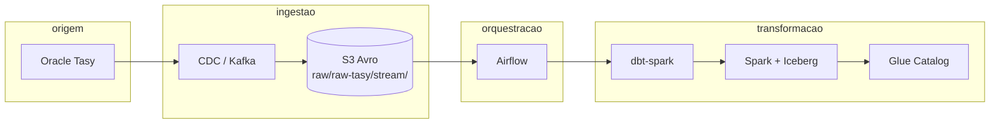

# Arquitetura do lakehouse — Hospital Austa (Tasy)

Este documento descreve o **fluxo de dados**, o **papel do dbt** e a **integração com o Airflow** no repositório [datalake-austa](https://github.com/Dev-Infra-Grupo-AMH/datalake-austa), alinhado ao código em `dbt/` e `airflow/dags/`.

---

## Visão de contexto

O **Hospital Austa** consolida dados operacionais do **Oracle Tasy** em um **data lake** na AWS. O pipeline atual combina **CDC** (mudanças contínuas), **armazenamento em S3 (Avro)** e **transformação no Spark** exposto via **Kyuubi/Thrift**, com catálogo **AWS Glue** e tabelas **Apache Iceberg**.

---

## Camadas lógicas

| Camada | Onde no dbt | Schema típico (Glue) | Conteúdo resumido |
|--------|-------------|----------------------|-------------------|
| **Raw** | (fora do dbt) | — | Avro no S3; eventos CDC por tópico. |
| **Bronze** | `models/bronze/` | `bronze` | Leitura Avro, janela `__ts_ms`, colunas de auditoria CDC; **append** incremental no Iceberg. |
| **Silver** | `models/silver/` | `silver` | `ref()` na bronze; **deduplicação** por chave de negócio; limpeza com macros; **merge** incremental + pós-hook de tombstones. |
| **Silver-Context** | `models/silver_context/` | `silver_context` | Joins entre entidades silver; visões analíticas (ex.: atendimento enriquecido). |
| **Gold** | `models/gold/` | `gold` | Modelagem dimensional (planejado; hoje há documentação de exemplo no `schema.yml`). |

Detalhes de “contrato” por camada: [DATA_CONTRACTS.md](DATA_CONTRACTS.md).

---

## Stack técnica do projeto dbt

| Componente | Uso |
|------------|-----|
| **dbt-core** + **dbt-spark** | Compilação e execução de modelos SQL. |
| **Spark (Thrift / Kyuubi)** | Engine de query; o laptop ou o Airflow enviam SQL ao cluster. |
| **Glue** | Metadados / catálogo. |
| **Iceberg** | Formato de tabela (`file_format: iceberg` no `dbt_project.yml`). |
| **Pacote `plugins/`** | `sitecustomize`: perfil dbt, `.env` e patch Thrift/Iceberg v2 — ver [PLUGINS.md](PLUGINS.md). |

---

## Airflow — o que o repositório faz hoje

### 1. Streaming / datasets (`airflow/dags/streaming/`)

A DAG **`stream_tasy_producer`**:

- Usa **`SqsSensor`** na fila configurada pela variável Airflow `s3_raw_tasy_sqs_queue_url`.
- Interpreta eventos S3 e, por tópico (`TOPIC_DATASET_MAPPING` em `common/constants.py`), dispara **outlets** do tipo **`Dataset`** cujo URI segue o padrão:

  `s3://{DATA_LAKE_BUCKET}/raw/raw-tasy/stream/{tópico}/`

Isso alinha com os paths `s3a://.../raw/raw-tasy/stream/tasy.TASY.*` usados nos modelos bronze do dbt.

### 2. Orquestração bronze (`airflow/dags/orchestration/bronze/`)

Para cada entidade Tasy mapeada, existe uma DAG **`bronze_tasy_<entidade>`** que:

- Agenda com **`schedule=[DATASET]`** — depende do dataset emitido pelo fluxo de streaming.
- Executa o modelo correspondente via **Astronomer Cosmos** (`DbtTaskGroup`), com configuração central em **`airflow/dags/common/cosmos_dbt.py`** (`LoadMode.DBT_LS`, `PYTHONPATH` para `dbt/plugins`, pool `spark_dbt`).

**Modelos bronze com DAG correspondente:**

- `bronze_tasy_atendimento_paciente`
- `bronze_tasy_atend_paciente_unidade`
- `bronze_tasy_conta_paciente`
- `bronze_tasy_proc_paciente_convenio`
- `bronze_tasy_proc_paciente_valor`
- `bronze_tasy_procedimento_paciente`

**Bronze em lote:** `airflow/dags/orchestration/bronze_dbt_task_group_all.py` (`path:models/bronze`) — acionada pelo **`master_dbt_orchestrator_batch`** ou manualmente; não participa do orquestrador stream.

### 3. Cosmos — camadas silver / silver_context / gold

- **`silver_dbt_task_group_all`**, **`silver_context_dbt_task_group_all`**: um `DbtTaskGroup` por camada (`path:models/...`), `schedule=None`, disparadas por **`master_dbt_orchestrator_stream`** (cron 30 min) ou pelo batch / manual.
- **`master_dbt_orchestrator_stream`**: `TriggerDagRunOperator` com `wait_for_completion` na ordem silver → silver_context (gold quando habilitado).
- **`master_dbt_orchestrator_batch`**: cadeia bronze all → silver → silver_context; opcional passo inicial `dbt run` com `--vars` (`run_cli_first`); gold quando habilitado.
- **`gold_dbt_task_group_all.py`**: scaffold **comentado** até existirem modelos em `dbt/models/gold/*.sql`; trechos `GOLD_LAYER_TODO` nos dois masters.

O arquivo legado **`airflow/dags/orchestration/dbt_lakehouse_dag.py`** não registra DAG — apenas aponta para os módulos acima.

**Dependência:** `astronomer-cosmos` (ver `airflow/requirements-cosmos.txt`). **Tags Airflow:** [airflow/dags/DAG_TAGS.md](../../airflow/dags/DAG_TAGS.md) (distinto de `tags:` no YAML do dbt).

A pasta `airflow/dags/README.md` resume o layout e o fluxo *raw → bronze → silver → silver_context → gold*.

---

## Onde aprofundar

| Tema | Documento |
|------|-----------|
| Convenções e exemplos por camada | [../docs/dbt_camadas.md](../../docs/dbt_camadas.md) |
| Bronze CDC (SQL detalhado) | [../docs/bronze.md](../../docs/bronze.md) |
| Contratos e responsabilidades | [DATA_CONTRACTS.md](DATA_CONTRACTS.md) |
| Macros e plugins | [MACROS.md](MACROS.md), [PLUGINS.md](PLUGINS.md) |
| Primeiros passos e comandos | [FLUXO_USO_E_DICAS.md](FLUXO_USO_E_DICAS.md) |
| Runbook operacional bronze | [../RUNBOOK_CDC_BRONZE.md](../RUNBOOK_CDC_BRONZE.md) |

---

## Constantes úteis (Airflow)

Definidas em `airflow/dags/common/constants.py`:

- **Bucket:** `austa-lakehouse-prod-data-lake-169446931765`
- **Prefixo stream (tópicos):** `raw/raw-tasy/stream/`
- **Mapeamento tópico → dataset** para agendamento das DAGs bronze: `TOPIC_DATASET_MAPPING`

Se o bucket ou o prefixo mudarem, os modelos bronze (``) e as constantes do Airflow devem ser revisados em conjunto.
